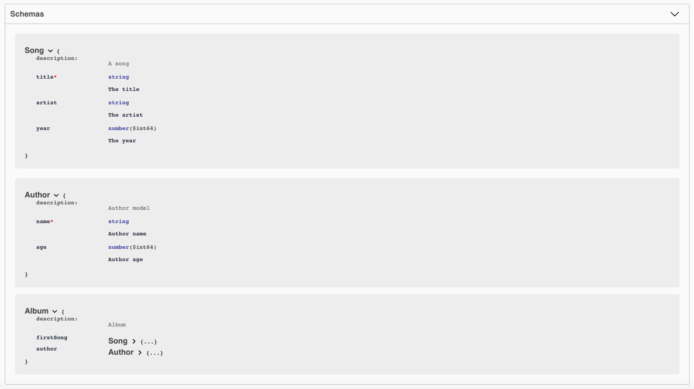

# Components
To define `components` [schema](https://swagger.io/docs/specification/components/):

```
/**
 * A song
 * @typedef {object} Song
 * @property {string} title.required - The title
 * @property {string} artist - The artist
 * @property {number} year - The year - int64
 */
```
Where:
- **typedef** is the name of the scheme and is **required**.
- The keyword `@property` is used to define the properties.
- Type is defined between `{}` followed by the name of the property.
- The following options, separated between ` - `, are the description and format (optional).


```
/**
 * Author model
 * @typedef {object} Author
 * @property {string} name.required - Author name
 * @property {number} age - Author age - int64
 */
```

The schemas previously defined (*Song and Author*) can also be used as properties of another scheme:
```
/**
 * Album
 * @typedef {object} Album
 * @property {Song} firstSong
 * @property {Author} author
 */
```

#### The result in UI swagger will be as follow:

