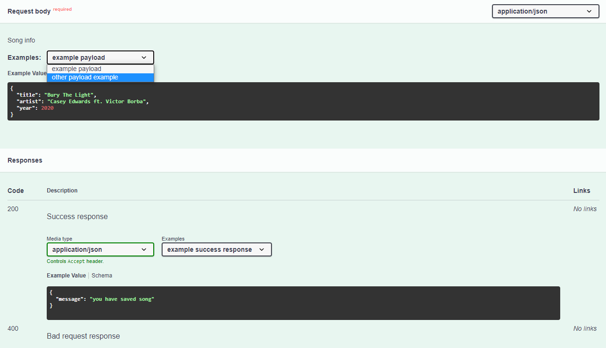

# Examples
To add [examples](https://swagger.io/docs/specification/adding-examples/) to your endpoints with [express-jsdoc-swagger](https://github.com/BRIKEV/express-jsdoc-swagger), you can use the `@example` annotation.

The following example illustrates how it can be used to add examples on how the request body must be, as well as what the endpoint is supposed to return for specific status codes.

```javascript
/**
 * POST /api/v1/song
 * @param {Song} request.body.required - Song info
 * @return {object} 200 - Success response
 * @return {object} 400 - Bad request response
 * @example request - example payload
 * {
 *   "title": "Bury The Light",
 *   "artist": "Casey Edwards ft. Victor Borba",
 *   "year": 2020
 * }
 * @example request - other payload example
 * {
 *   "title": "The war we made",
 *   "artist": "Red",
 *   "year": 2020
 * }
 * @example response - 200 - example success response
 * {
 *   "message": "You have added a song!"
 * }
 * @example response - 400 - example error response
 * {
 *   "message": "Failed to save song because you did not specify a title",
 *   "errCode": "EV121"
 * }
 */
app.post('/api/v1/song', (req, res) => res.send({
  message: 'You have added a song!',
}));
```

The result in Swagger UI will look like this:



> You can find more working examples [here](https://github.com/BRIKEV/express-jsdoc-swagger/blob/master/examples/requestBody/withExamples.js) or [here](https://github.com/BRIKEV/express-jsdoc-swagger/blob/master/examples/responses/withExamples.js).

## Usage instructions

The `@example` annotation must be immediatly be followed by a keyword that will represent what our example will be illustrating: `request` or `response`.

> It's possible to add as many examples as required for both requests and responses in a single endpoint, there's no limit on that. In the case of responses, multiple examples for the same status code are also supported (so we can provide different examples of what our API will return if it succeeds, for example).

The sections below describe in more in detail the expected syntax for the `@example` tag in each case (request and responses). Although it's same for the most part, it will differ slightly depending on the keyword used.

### Request body example

```
@example request - [summary]
[content]
```

| Field | Description |
| --- | --- |
| Summary | Small text that briefly describes the example. This text must occupy a single line. Everything outside of the `@example` tag line will be considered part of the example content and *NOT* the summary. |
| Content | Example content for the request body. It's imperative that its contents start at a new line below the `@example` tag, and not in the same one. The content can be split into multiple lines if necessary, for better readibility. Indentation and breaklines will be preserved in Swagger UI. |

> You can check out more examples [here](https://github.com/BRIKEV/express-jsdoc-swagger/blob/master/examples/requestBody/withExamples.js).

### Response body example

```
@example response - [status code] - [summary]
[content]
```

| Field | Description |
| --- | --- |
| Status code | An HTTP status code (ex.: `200`). Keep in mind that any code not available in [validStatusCodes](https://github.com/BRIKEV/express-jsdoc-swagger/blob/master/transforms/paths/validStatusCodes.js) will be ignored. Also, it's necessary for a `@return` tag to exist for that same code in order for the example to appear in Swagger UI. |
| Summary | Small text that briefly describes the example. This text must occupy a single line. Everything outside of the `@example` tag line will be considered part of the example content and *NOT* the summary. |
| Content | Example content for the response body. It's imperative that its contents start at a new line below the `@example` tag, and not in the same one. The content can be split into multiple lines if necessary, for better readibility. Indentation and breaklines will be preserved in Swagger UI. |

> You can check out more examples [here](https://github.com/BRIKEV/express-jsdoc-swagger/blob/master/examples/responses/withExamples.js).
