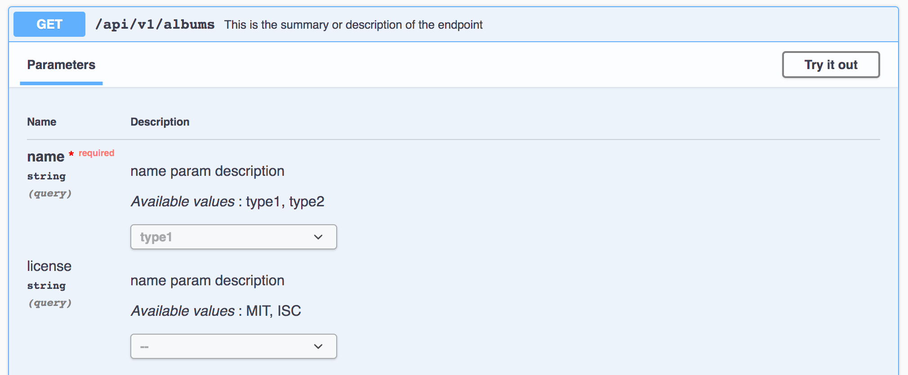

# Parameters
Para añaidr [parameters](https://swagger.io/docs/specification/describing-parameters/) a tus endpoints con `express-jsdoc-swagger`, puedes añadir los siguientes comentarios:

```javascript
/**
 * GET /api/v1/{id}
 * @summary This is the summary or description of the endpoint
 * @param {string} name.query.required - name param description
 * @param {number} id.path - phone number
 * @return {string} 200 - success response
 */
app.get('/api/v1/:id', (req, res) => res.send('Hello World!'));
````

Dónde:
- `@param` se utiliza para definir un parámetro.
- El [tipo](https://swagger.io/specification/#data-types) se define entre `{}`.
- Después del tipo, se define el nombre que queremos para ese parámetro.
- Puedes definir el estado de tu parámetro así:
  - `* @param {string} name.query.required` donde `name` será un param de consulta requerido.
  - `* @param {string} name.query.deprecated` donde `name` será un parámetro de consulta deprecado.
  - `* @param {cadena} name.query` donde `name` será un parámetro de consulta.
- La siguiente opción, separada entre "-", es la descripción.

Se pueden añadir **valores númericos (enum)** a los parámetros así:

```javascript
/**
 * GET /api/v1/albums
 * @summary This is the summary or description of the endpoint
 * @param {string} name.query.required - name param description - enum:type1,type2
 * @param {string} license.query - enum:MIT,ISC - name param description
 * @return {object} 200 - success response - application/json
 */
```

El último parámetro puede ser usado como un enum, o se puede cambiar de orden entre enum y descripción.

El resultado en la interfaz de usuario será este:



> Puedes ver más ejemplos [aquí](https://github.com/BRIKEV/express-jsdoc-swagger/tree/master/examples/parameters).
