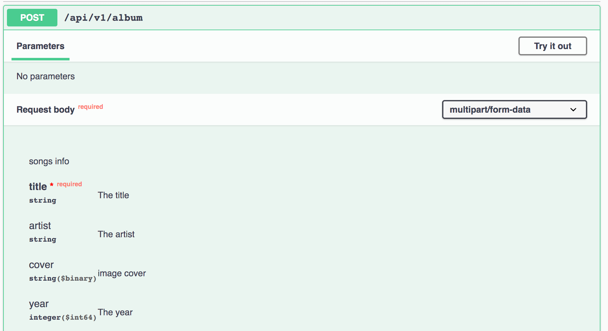

# Request body
Para añadir un [request body](https://swagger.io/docs/specification/describing-request-body/) en tus endpoints con express-jsdoc-swagger, puedes añadir estos comentarios:

```javascript
/**
 * POST /api/v1/album
 * @param {object} request.body.required - songs info - application/json
 */
app.post('/api/v1/album', (req, res) => res.send('You save a song!'));
```

Donde:
- `@param` es utilizado para definir un parametro.
- [El type](https://swagger.io/specification/#data-types) está definido entre `{}`.
- Después del tipo, puedes definir la palabra reservada **request.body**. Está debe tener el valor que tu queres usar como body de la petición.
- La siguiente opción, separada por ` - `, es la descripción.
- La última opción *(application/json)* específica el request type. Esta es opcional y por defecto *application/json*.

Puedes mezclar esto con los [components](components.md) para definir un payload basado en un componente como en este ejemplo:

```javascript
/**
 * A song
 * @typedef {object} Song
 * @property {string} title.required - The title
 * @property {string} artist - The artist
 * @property {integer} year - The year - int64
 */

/**
 * POST /api/v1/song
 * @param {Song} request.body.required - song info
 * @return {object} 200 - song response
 */
app.post('/api/v1/songs', (req, res) => res.send('You save a song!'));

/**
 * POST /api/v1/album
 * @param {array<Song>} request.body.required - songs info
 * @return {object} 200 - album response
 */
app.post('/api/v1/album', (req, res) => res.send('You save a song!'));
````

También puedes añadir form-data requests para documentar archivos:

```javascript
/**
 * A song
 * @typedef {object} Song
 * @property {string} title.required - The title
 * @property {string} artist - The artist
 * @property {string} cover - image cover - binary
 * @property {integer} year - The year - int64
 */

/**
 * POST /api/v1/album
 * @param {Song} request.body.required - songs info - multipart/form-data
 * @return {object} 200 - Album created
 */
app.post('/api/v1/album', (req, res) => res.send('You save a song!'));
```

En ese ejemplo, usamos la última opción de la palabra reservada `@param` para especificar el request media type como multipart/form-data.

El resultado en SwaggerUI sería algo así:



> Para aprender como añadir ejemplos al body de tus endpoint, puedes revisar la sección de [ejemplos](examples.md).

> Para aprender a definir esquemas de componentes, puedes visitar la sección de [componentes](components.md).

> Puedes revisar más ejemplos [aquí](https://github.com/BRIKEV/express-jsdoc-swagger/tree/master/examples/requestBody).

### Body como parámetro de formulario

Puedes enviar parametros sin necesidad de usar un componente. Para eso puedes crear comentarios de la siguiente manera:

```javascript
/**
 * POST /api/v1/song
 * @param {string} id.form.required - This is the song id - application/x-www-form-urlencoded
 * @param {string} title.form.required - This is the song title - application/x-www-form-urlencoded
 * @return {object} 200 - song response
 */
app.post('/api/v1/songs', (req, res) => res.json({}));
```

Donde:
- `@param` es utilizado para definir un parametro.
- [El type](https://swagger.io/specification/#data-types) está definido entre `{}`.
- Después del tipo, tenemos que definir la key que queremos como parámetro seguido del **form**.
- La siguiente opción, separada por ` - `, es la descripción.
- La última opción *(application/json)* específica el request type. Esta es opcional y por defecto *application/json*.

**IMPORTANTE:** Para usar esta opción es requerido poner una descripción a cada valor

> Puedes revisar más ejemplos [aquí](https://github.com/BRIKEV/express-jsdoc-swagger/blob/master/examples/requestBody/formParameters.js).
