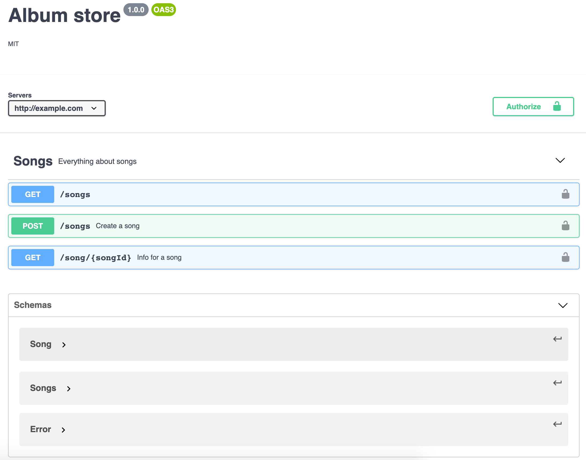
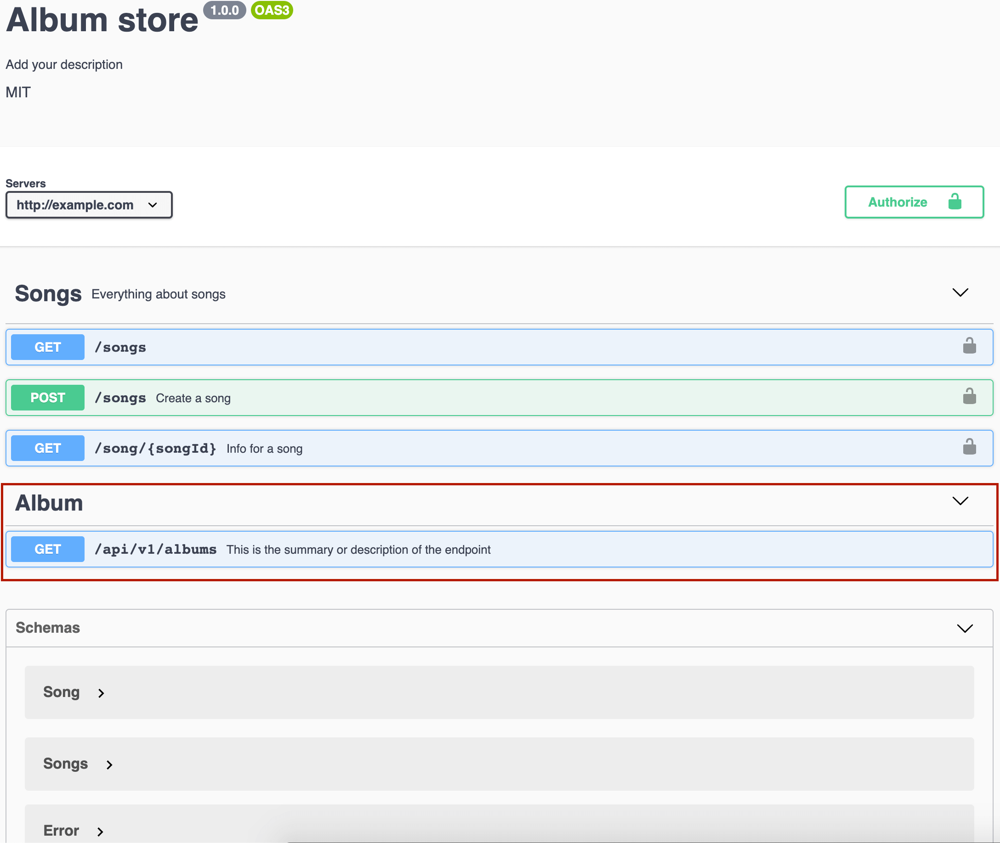

# Extend your swagger file

This option is useful if you have an old project and you only want to add comments on new endpoints, or you want to add new features that we don't support.

## Example
You could have one `swagger.json` already defined like this one:
<details><summary>Click to expand</summary>

```js
{
  "openapi": "3.0.0",
  "info": {
    "version": "1.0.0",
    "title": "Album store",
    "license": {
      "name": "MIT"
    }
  },
  "servers": [
    {
      "url": "http://example.com"
    }
  ],
  "tags": [
    {
      "name": "Songs",
      "description": "Everything about songs"
    }
  ],
  "paths": {
    "/songs": {
      "get": {
        "operationId": "songList",
        "tags": [
          "Songs"
        ],
        "responses": {
          "200": {
            "description": "songs array",
            "headers": {
              "x-next": {
                "description": "A link to the next page of responses",
                "schema": {
                  "type": "string"
                }
              }
            },
            "content": {
              "application/json": {
                "schema": {
                  "$ref": "#/components/schemas/Songs"
                }
              }
            }
          },
          "default": {
            "description": "unexpected error",
            "content": {
              "application/json": {
                "schema": {
                  "$ref": "#/components/schemas/Error"
                }
              }
            }
          }
        }
      },
      "post": {
        "summary": "Create a song",
        "security": [
          {
            "BasicAuth": []
          }
        ],
        "operationId": "createSong",
        "tags": [
          "Songs"
        ],
        "responses": {
          "201": {
            "description": "Null response"
          },
          "default": {
            "description": "unexpected error",
            "content": {
              "application/json": {
                "schema": {
                  "$ref": "#/components/schemas/Error"
                }
              }
            }
          }
        }
      }
    },
    "/song/{songId}": {
      "get": {
        "summary": "Info for a song",
        "operationId": "showSongById",
        "tags": [
          "Songs"
        ],
        "parameters": [
          {
            "name": "songId",
            "in": "path",
            "required": true,
            "description": "The id of the song to retrieve",
            "schema": {
              "type": "string"
            }
          }
        ],
        "responses": {
          "200": {
            "description": "Expected response to a valid request",
            "content": {
              "application/json": {
                "schema": {
                  "$ref": "#/components/schemas/Song"
                }
              }
            }
          },
          "default": {
            "description": "unexpected error",
            "content": {
              "application/json": {
                "schema": {
                  "$ref": "#/components/schemas/Error"
                }
              }
            }
          }
        }
      }
    }
  },
  "security": [
    {
      "BasicAuth": []
    },
    {
      "bearerAuth": []
    }
  ],
  "components": {
    "securitySchemes": {
      "BasicAuth": {
        "type": "http",
        "scheme": "basic"
      },
      "bearerAuth": {
        "type": "http",
        "scheme": "bearer",
        "bearerFormat": "JWT"
      }
    },
    "schemas": {
      "Song": {
        "type": "object",
        "required": [
          "id",
          "name"
        ],
        "properties": {
          "id": {
            "type": "integer",
            "format": "int64"
          },
          "name": {
            "type": "string"
          }
        }
      },
      "Songs": {
        "type": "object",
        "properties": {
          "song": {
            "type": "array",
            "items": {
              "$ref": "#/components/schemas/Song"
            }
          }
        }
      },
      "Error": {
        "type": "object",
        "required": [
          "code",
          "message"
        ],
        "properties": {
          "code": {
            "type": "integer",
            "format": "int32"
          },
          "message": {
            "type": "string"
          }
        }
      }
    }
  }
}
```
</details>

Which renders the next SwaggerUI:



If you want to *integrate* your API written with `jsdoc` comments and your `swagger.json`, you can check out this example:

```javascript
const express = require('express');
const oldSwagger = require('./swagger.json'); // This file contains the previously mentioned swagger.json
const expressJSDocSwagger = require('express-jsdoc-swagger');

const options = {
  info: { // version and title are required
    version: '1.0.0',
    title: 'Albums store',
  },
  filesPattern: './simple.js',
  baseDir: __dirname,
};

const app = express();
const port = 3001;

// To merge swagger.json we had with the new endpoints, It will be passed as a second parameter:
expressJSDocSwagger(app)(options, oldSwagger);

// Example of new endpoint:
/**
 * GET /api/v1/albums
 * @summary This is the summary or description of the endpoint
 * @tags Album
 * @param {array<object>} name.query.required - name param description
 * @return {array<object>} 200 - success response - application/json
 */
app.get('/api/v1/albums', (req, res) => (
  res.json([{
    title: 'abum 1',
  }])
));

app.listen(port, () => console.log(`Example app listening at http://localhost:${port}`));

```

Finally, the result in the SwaggerUI will be the following:



> You can check out more examples [here](https://github.com/BRIKEV/express-jsdoc-swagger/tree/master/examples/merge).
