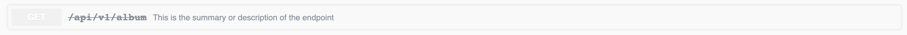
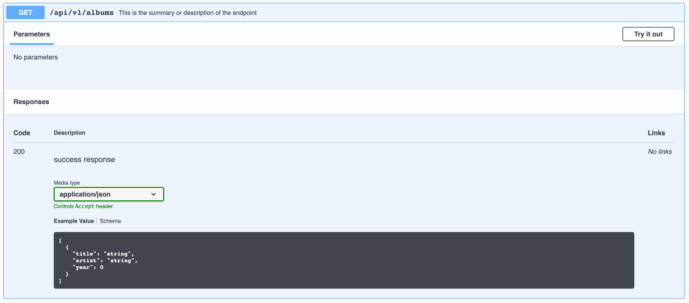

# Responses
To add [responses](https://swagger.io/docs/specification/describing-responses/) to your endpoints with express-jsdoc-swagger, you could add these comments:

```javascript
/**
 * GET /api/v1
 * @summary This is the summary or description of the endpoint
 * @return {string} 200 - success response
 * @return {object} 400 - Bad request response
 */
app.get('/api/v1', (req, res) => res.send('Hello World!'));
```

Where:
- `@summary` is the endpoint description.
- `@return` is used to define the response.
- [Type](https://swagger.io/specification/#data-types) is defined between `{}`.
- After the type, you have to define the HTTP status code.
- The following option, separated between ` - `, is the description.

You can mark specific operations as deprecated with `@deprecated` keyword:
```javascript
/**
 * GET /api/v1/album
 * @summary This is the summary or description of the endpoint
 * @deprecated
 * @return {object} 200 - success response
 * @return {object} 400 - Bad request response
 */
app.get('/api/v1/album', (req, res) => (
  res.json({
    title: 'abum 1',
  })
));
```
This looks like:



Also you can assign a list of tags to each API operation:
```javascript
/**
 * GET /api/v2/album
 * @summary This is the summary or description of the endpoint
 * @tags album
 * @security BasicAuth
 * @return {object} 200 - success response
 * @return {object} 400 - Bad request response
 */
app.get('/api/v2/album', (req, res) => (
  res.json({
    title: 'abum 1',
  })
));
```
> If you want to know more about `@tags`, please visit [tags](tags.md) section.

You can return a common schema:
```javascript
/**
 * GET /api/v1/albums
 * @summary This is the summary or description of the endpoint
 * @tags album
 * @return {array<Song>} 200 - success response - application/json
 */
app.get('/api/v1/albums', (req, res) => (
  res.json([{
    title: 'abum 1',
  }])
));
```
In this case:
- The endpoint returns a Song array.
- The last option of the keyword `@return` *(application/json)* specify the response media types. This is optional and its default value is *application/json*.

The result in swagger UI will be this:



> To learn how to add examples of your endpoint's output, check out the [examples](examples.md) section.

> To learn how define components schemas, please visit [components](components.md) section.

> You can check out more examples [here](https://github.com/BRIKEV/express-jsdoc-swagger/tree/master/examples/responses).
