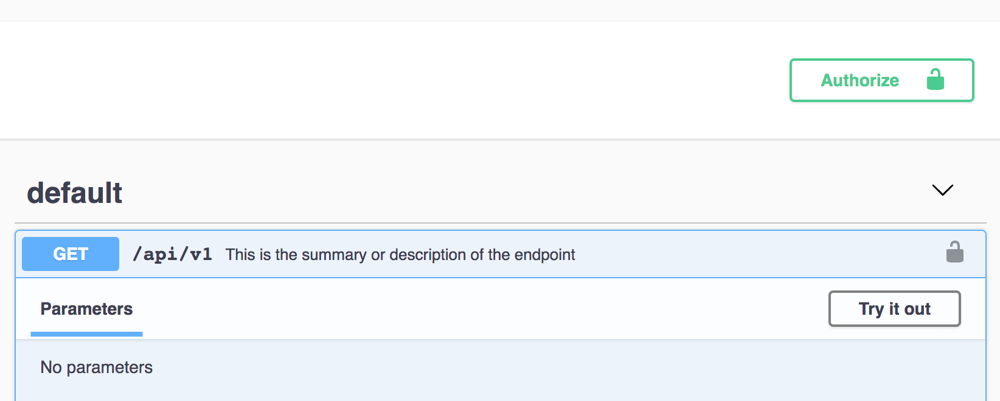

# Security
To add [Authentication](https://swagger.io/docs/specification/authentication/) to your endpoints with express-jsdoc-swagger, you have to add your security schemas to the config object when you create your instance:

```javascript
const express = require('express');
const expressJSDocSwagger = require('express-jsdoc-swagger');

const options = {
  info: {
    version: '1.0.0',
    title: 'Albums store',
    license: {
      name: 'MIT',
    },
  },
  security: {
    BasicAuth: {
      type: 'http',
      scheme: 'basic',
    },
  },
  filesPattern: './basic-auth.js',
  baseDir: __dirname,
};

const app = express();
const port = 3000;

expressJSDocSwagger(app)(options);
```

- `Security` key is used to define your security schemas, and it is optional in case you don't want any type of security.

After you add your security schemas, you can use them in your endpoints like this:

```javascript
/**
 * GET /api/v1
 * @summary This is the summary or description of the endpoint
 * @return {string} 200 - success response
 * @security BasicAuth
 */
app.get('/api/v1', (req, res) => res.send('Hello World!'));
```

The result in swagger UI will be this:



> You can check out more examples [here](https://github.com/BRIKEV/express-jsdoc-swagger/blob/master/examples/security/basic-auth.js).
