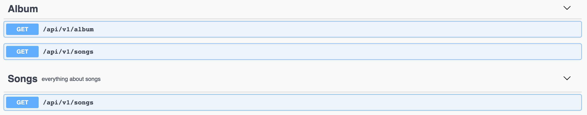

# Tags
You can assign a list of [tags](https://swagger.io/docs/specification/grouping-operations-with-tags/) to each API operation.

To define a tag with express-jsdoc-swagger:
```
/**
 * GET /api/v1/album
 * @tags Album - everything about album
 */
```
Where:
- The keyword `@tags` is used to assign to the endpoint.
- The following option, separated between ` - `, is the description.

Furthermore, the same tag can be assigned to several endpoints:
```
/**
 * GET /api/v1/songs
 * @tags Album
 * @tags Songs - everything about songs
 */
```
In this case, the tags `Album` and `Song` have been assigned to the endpoint songs and the result is as follows:



